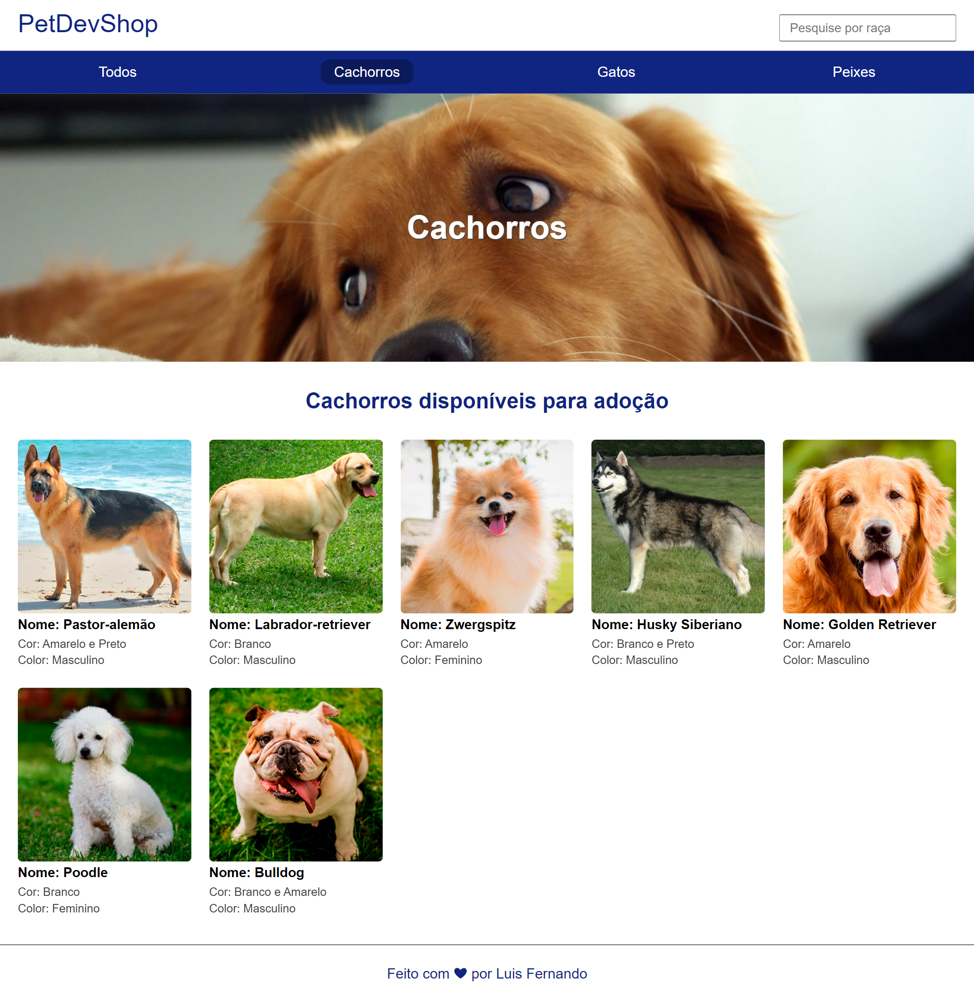

# nodets-canil
Projeto feito no módulo de nodeJs - b7web

## Pré-requisitos globais
`npm i -g nodemon typescript ts-node`

### Instalação
`npm install`

#### Para executar o projeto
`npm run start-dev`

## Imagens:

